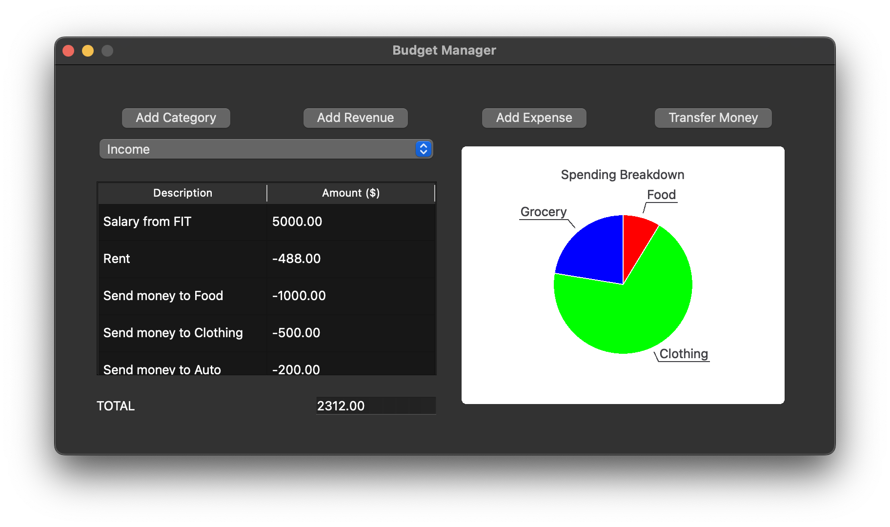
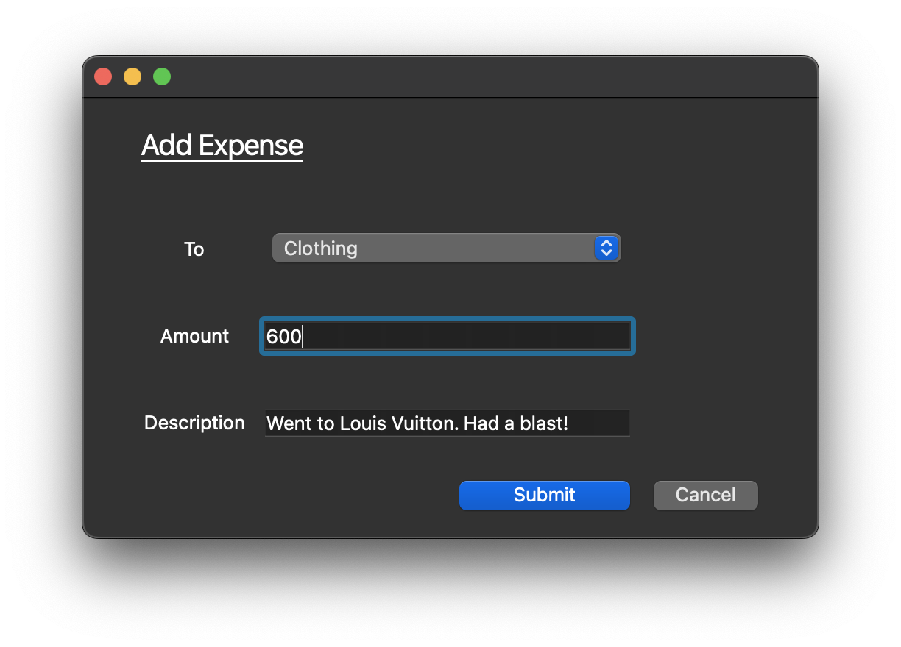
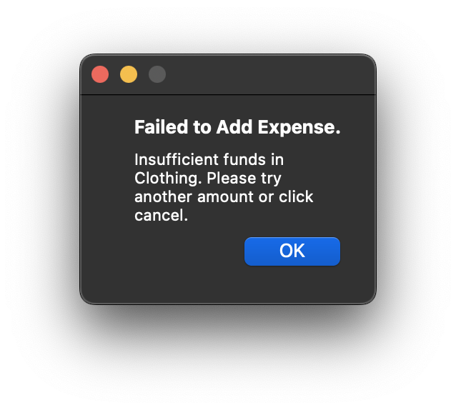
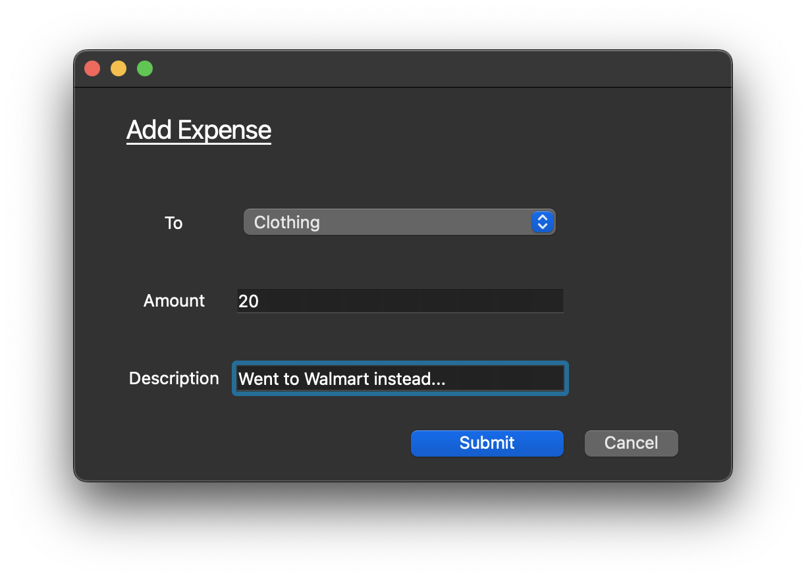
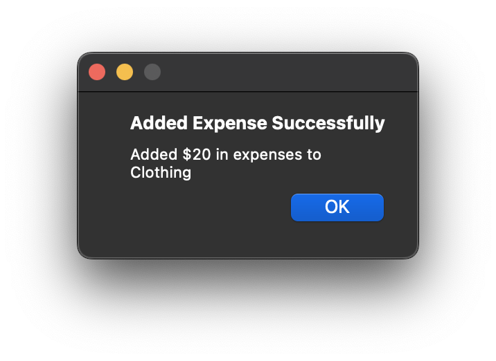

# Hey,

This project served as a final assignment for a course in Python Programming that I took. It uses PyQt6 to create and update an interactive GUI that simulates a Budget Manager with an emphasis on expenses.

It contains operations for separating transaction types, transferring money between different types, and expense/revenue adding. 

Most importantly, the application heavily emphasizes data visualization with an easy-to-read graph that updates with every added expense and transaction record that updates with every transaction or category addition.

### GUI

